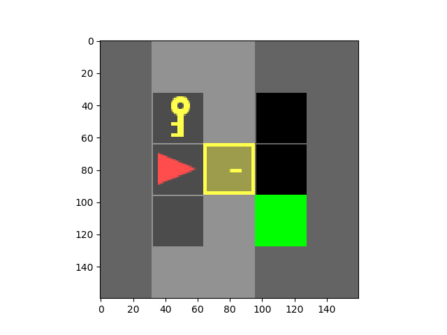
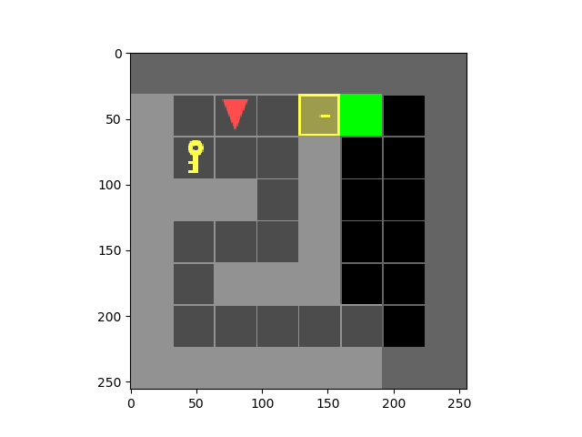

# Dynamic Programming for Deterministic Shortest Path

## Overview
In this assignment, we are required to implement dynammic programming for the Door-Key problems.

 

There are 7 test scenes you have to test and include in the report.

| doorkey-5x5-normal |
|:----------------:|
|  |

| doorkey-6x6-normal   | doorkey-6x6-direct | doorkey-6x6-shortcut |
|:----------------:|:------------------:|:----------------:|
|  |  ||

| doorkey-8x8-normal   | doorkey-8x8-direct | doorkey-8x8-shortcut |
|:----------------:|:------------------:|:----------------:|
|  |  ||

## Environment Setup

1. Create a cond environment using the ece276b.yaml file provided. 
<pre>conda env create -f ece276b.yaml </pre>
2. Activate the conda environment. 
<pre>conda activate ece276b </pre>

## Instructions to run
### 1. utils.py
You might find some useful tools in utils.py
- **step()**: Move your agent
- **generate_random_env()**: Generate a random environment for debugging
- **load_env()**: Load the test environments
- **save_env()**: Save the environment for reproducing results
- **plot_env()**: For a quick visualization of your current env, including: agent, key, door, and the goal
- **draw_gif_from_seq()**: Draw and save a gif image from a given action sequence.

### 2. example.py
The example.py shows you how to interact with the utilities in utils.py, and also gives you some examples of interacting with gym-minigrid directly.
Usage : 
<pre>python3 examples.py </pre>

### 3. doorkey_A.py
This script is used to implement Dynamic Programming on the environments specified in Part A. There are seven different parts in A, and this code will create the shortest paths for each of the environments.
Usage: 
<pre>python3 doorkey_A.py </pre>

### 4. doorkey_B.py
This script is used to implement Dynamic Programming on the environments specified in Part B. This program creates a single policy function for all the maps in Part B and creates the shortest path for any environment in this from the single policy function. 
Usage : 
<pre>python3 doorkey_B.py </pre>

## Directory
<pre>
├── envs
│   └── random_envs
├── gif
│   ├── partA
│   └── partB
├── imgs
├── __pycache__
├── report
└── results
    ├── partA
    │   ├── 1
    │   ├── 2
    │   ├── 3
    │   ├── 4
    │   ├── 5
    │   ├── 6
    │   ├── 7
    │   └── 8
    └── partB
        ├── 1
        ├── 2
        ├── 3
        ├── 4
        ├── 5
        ├── 6
        ├── 7
        ├── 8
        └── 9
</pre>

Results are present in results/partA/ for part A environments and results/partB/ for partB environments. GIF's of the shortest paths are in gif/partA and gif/partB for the partA and partB environments respectively. 

## Technical report
* [Sambaran Ghosal. "Dynamic Programming for Deterministic Shortest Path problem" April 2022](report/Dynamic_Programming_DSP.pdf)

## Results
### Part A

| doorkey-5x5-normal |

 

| doorkey-6x6-normal   |

 

| doorkey-6x6-direct |

 

| doorkey-6x6-shortcut |

 

| doorkey-8x8-normal   |

 

| doorkey-8x8-direct |

 

| doorkey-8x8-shortcut |

 

### Part B
| Sample environment 1 |

 

| Sample environment 2 |

 

| Sample environment 3 |

 

